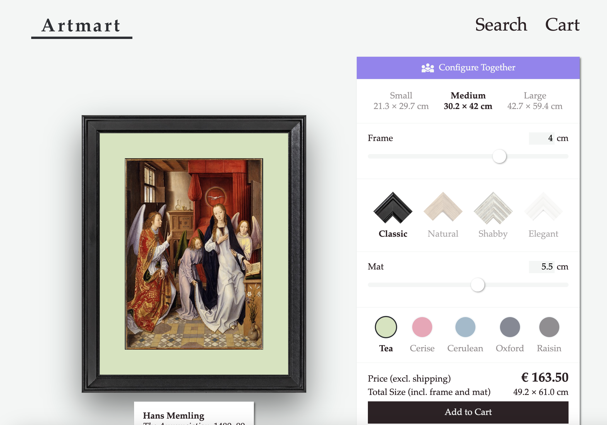
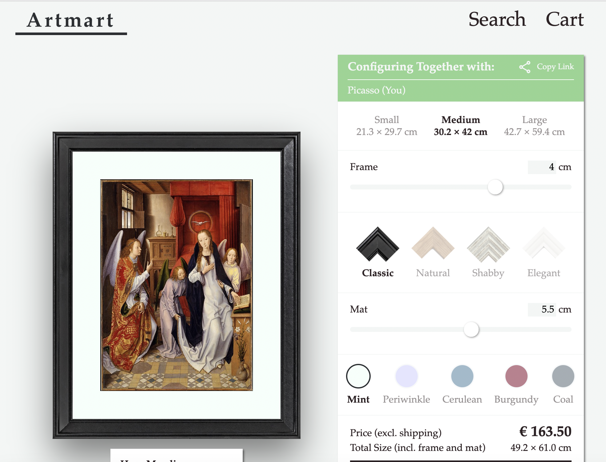
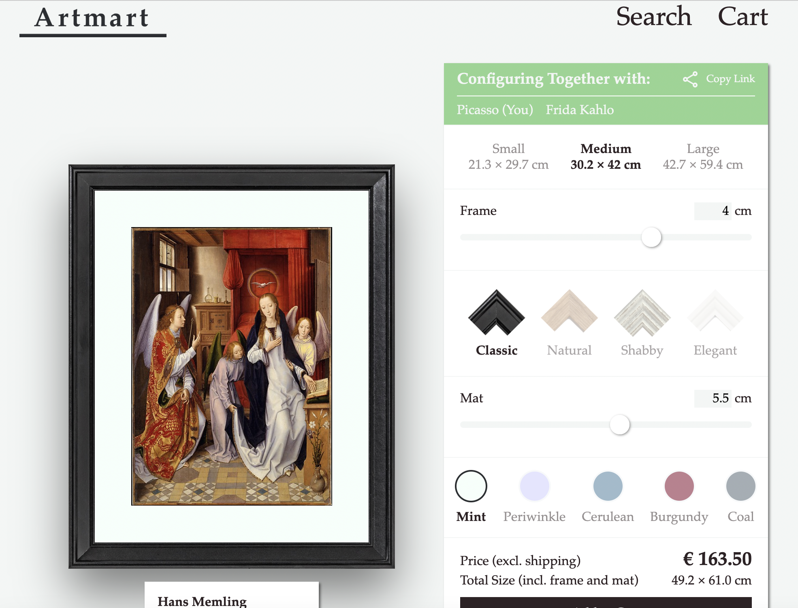
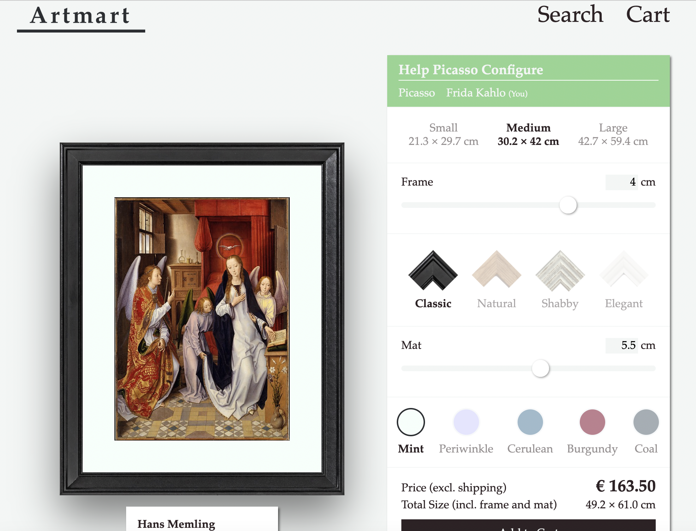

# Assignment 3: Backend with Node.js

In this third assignment, you are tasked with implementing a backend API server for __Artmart__. Additionally to the features you already know, our marketing team came up with a new idea called "Configure Together". They want users to be able to invite friends to help them configure their frame. While the design team is still at works figuring out how this new feature should look like, you are already tasked with implementing the backend for this functionality. To help you visualize the idea the design team sent us initial mockups which you can find at the end of this readme.

You will be using [Node.js](https://nodejs.org) and the [Express](https://expressjs.com) framework (version 4). The `server` folder already contains a partial solution which you should use as a starting point. As always, take a look at what's there and figure out what remains to be done.

## What you need to do

- You need to fully implement both the API specified in the [Artmart API documentation][api_docs] and the [Artmart WebSocket Protocol][ws_docs], as well as fulfill the additional requirements described below.

For the **``/artworks``** endpoint:

- You should implement an API gateway to the [Metropolitan Museum of Art Collection API][met_api]. In particular, `artworkId` should be identical with the Met API's `objectId`. The `image` should be `primaryImageSmall`.

- Your Met API gateway should cache responses from the Met API, so that subsequent requests to your server do not cause redundant Met API queries. This applies to the *Object* as well as the *Search* endpoints of the Met API.

- It is sufficient for the Met API cache to be entirely in-memory.

- It is *not* necessary to implement any kind of cache eviction or garbage collection strategy for the cache. But be careful to only cache necessary information.

- The "selected highlights" mentioned in the API docs can be found in `server/resources/highlights.json`.

For the **``/cart``** endpoint:

- You should use an appropriate in-memory data structure to associate session IDs with shopping carts. Do not use any kind of database or persistent offline storage. You can use the [nanoid] library to create unique session IDs.

- Again, it is *not* necessary to implement any kind of cache eviction or garbage collection strategy for the shopping cart sessions.

- Note that when you are adding an item to the shopping cart, the client does *not* include the price. You should calculate the price server-side. The template code contains a function to help you with that (see `server/utils/price.js`).

For the **``/cart/checkout``** endpoint:

- You need to interface with the [Bling payment service][bling]. Read the Bling documentation carefully. You need to implement the server side of the payment flow. For testing purposes, you can play the part of the client using [curl](https://curl.haxx.se) or [HTTPie](https://httpie.org).

- To implement the checkout process, you will need to keep track of orders and payment intents. Use appropriate in-memory data structures. Do not use any databases or persistent storage.

- In order to create a payment intent you will need to calculate the total price of all items in the shopping cart including shipping. You can calculate the shipping costs using the selected country's `price` and `freeShippingThreshold` from `shipping.json`. If the subtotal is above the free shipping threshold, the shipping costs are zero.

- Your Bling API key is `ak_s24a3m01234567` with `01234567` replaced by your 8 digit student ID (Matrikelnummer). (Yes, the supposedly secret API key is easily guessable. This is just an exercise. Please don't do anything stupid.)

- The Bling API key should be provided to your server via an environment variable named `BLING_API_KEY`. Do not hardcode it!

- To debug the webhook, we recommend that you use [ngrok](https://ngrok.com) to temporarily expose your local server to the public internet over a secure tunnel. Note that this is only necessary if you want to understand the webhook workflow better, the test scripts do not depend on the real Bling service and you do not need ngrok to run the tests.

- In real life, you would secure the payment webhook. Preferably, it would only be accessible by whitelisted IP addresses of the payment provider. At the very least, there would be some kind of cryptographic signature check. For this assignment, it is sufficient to ensure that any event you receive on the webhook corresponds to a valid order within your system.

- In order to correctly set the `webhook` parameter when creating a payment intent with Bling, you need to know your server's base URL. Running locally, this will be something like `http://localhost:3000`. If you're tunneling via ngrok, you have a public URL like `https://xyz.ngrok.io`. In either case, you should pass along the server's base URL via an environment variable named `ARTMART_BASE_URL`. Do not hardcode it!

- When a payment succeeds and your server receives a notification from Bling, you should create a receipt for the successful order. For an example, see `server/orders/order-0000.json`. Receipts should be sequentially numbered and put into the `server/orders` folder. The template code contains a function to help you with that (see `/server/utils/orders.js`).

- Note that if an order was successful, the shopping cart should be empty again.

For the **``/frames``**, **``/mats``**, and **``/shipping``** endpoints:

- The available frames, mat colors and shipping destinations can be found in the `server/resources` folder.

For the **WebSocket** protocol:

- As with the shopping cart, you should use an appropriate in-memory data structure to store sessions. You can use the [nanoid] library to create unique session IDs.

- If a client attempts to connect to an invalid session ID, the server sends an `error` packet with a payload of `{"message":"Invalid session"}` and closes the connection.

- If the host closes the socket connection before sending a `{"op": "done", "data": {"success": true}}` message, the server must send a `{"op": "done", "data": {"success": false}}` to every client and close the connections.

- Usernames should be assigned based on the `server/resources/usernames.json` file. Always assign the first username (in order of position in the array) that is currently not assigned to another user. If all usernames have been assigned in a session, no more clients can join the session. A client attempting to join a full session receives an `error` packet with a payload of `{"message":"Session full"}` before the server closes their connection.

- The server needs to validate all state updates it receives. You can reuse the validation logic from the shopping cart. If a client sends an invalid state update, it should receive an `error` packet with a payload of `{"message":"Invalid payload"}`; the connection should stay open.

- Whenever the server receives a valid `update_state` packet, it must update its internal state and broadcast the new state to all clients. The server's state is updated on a first come, first serve basis.

- The server needs to terminate idle sessions. If it has not received a message from any client in a session for a certain time, it must send an `error` packet with a payload of `{"message": "Session timed out"}` to all clients in the session and then close all client sockets. The timeout is stored in an environment variable named `WS_TIMEOUT` (in milliseconds).

## Additional notes

- Do not modify `package.json` or install any additional packages. You are not allowed to use any third-party libraries, beyond the ones we have provided. (This also means you can't use TypeScript. Sorry.)

- You *must* use [node-fetch] to make HTTP requests from your server to other web services.

- Once again, there will be automated tests. **The tests are part of the specification.**

- If something is not covered by the tests *but specified in the assignment*, then we expect you to implement it. We might run additional tests on our end. Inversely, if something is not specified in the assignment *but expected by the tests*, then we also expect you to implement it.

- **Keep it simple.** Don't read too much into the assignment. Try the simplest solution that could possibly work. Don't do anything fancy. There are no extra points for over-engineering.

- **This is a solo exercise.** You are required to solve it on your own. We encourage you to discuss the assignment with your coursemates, to ask questions on TUWEL, and to participate in the tutor hours. However, you will ultimately need to write your own code. You are not allowed to copy someone else's solution or solutions from previous years. *We have automated systems that check for plagiarism.*

- Please, for the love of god, **do not use real credit card numbers**.

## How to start the server and/or run the tests

1. You need to have [Node.js](https://nodejs.org) installed. We recommend at least `node v20.11.1`, together with `npm v10.2.4` or later.

2. Make sure you are in the top-level directory of this project (viz. the directory this README file is in).

3. If this is the first time, install the required dependencies using `npm install`. You only need to do this once.

4. Now you can start your server with `npm start` or run the tests with `npm test`. As always, the tests will print out your point total and generate a detailed `report.html` file.

> :warning: **Do not modify `package.json` or anything in the `test` folder.** For the final assessment, we will copy your `server` folder into our own test environment (which also might include additional tests). If your code depends on modifications outside the `server` folder (no matter how trivial!) it will not pass the final tests.

## Configure Together Mockups

### Initial Framing View before sharing

### Host view after sharing

### Host view after Guest joined

### Guest View

[api_docs]: ./api.md
[ws_docs]: ./ws.md
[met_api]: https://metmuseum.github.io
[bling]: https://web-engineering.big.tuwien.ac.at/s24/bling
[nanoid]: https://github.com/ai/nanoid
[node-fetch]: https://github.com/node-fetch/node-fetch
